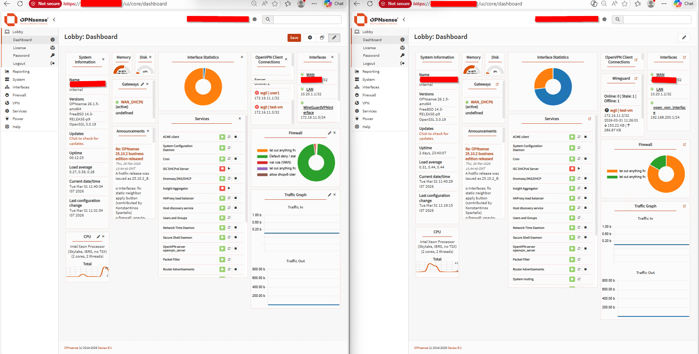
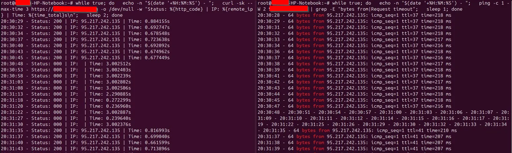
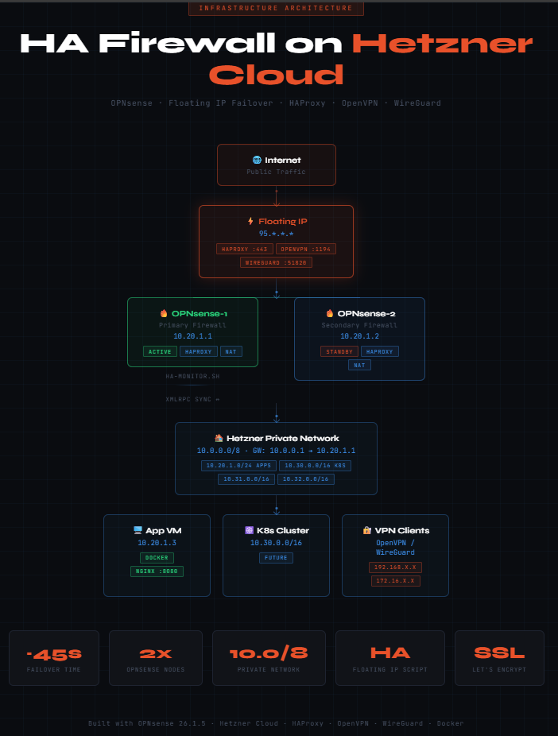

# High Availability Firewall on Hetzner Cloud using OPNsense

A production-grade High Availability (HA) firewall setup using OPNsense on Hetzner Cloud with floating IP failover, OpenVPN, WireGuard, HAProxy SSL termination, and private network routing — without CARP .
## Architecture Overview

                        Internet
                           │
                      Floating IP
                       95.*.*.*
                           │
              ┌────────────┴────────────┐
              │                         │
        OPNsense-1               OPNsense-2
        10.20.1.1                10.20.1.2
        (Primary)                (Secondary)
              │                         │
              └────────────┬────────────┘
                           │
                  Hetzner Private Network
                       10.0.0.0/8
                     GW: 10.0.0.1
                           │
                    ┌──────┴──────┐
                    │             │
              App VM (10.20.1.3)  K8s (10.30.0.0/16)
              Docker + Nginx      (future)     
##  Infrastructure Components

| Component              | Details                       |
|------------------------|-------------------------------|
| Cloud Provider         | Hetzner Cloud                 |
| Firewall OS            | OPNsense 26.1.5-amd64         |
| Private Network        | 10.0.0.0/8                    |
| Hetzner Default GW     | 10.0.0.1                      |
| OPNsense-1 (Primary)   | Public IP + Private 10.20.1.1 |
| OPNsense-2 (Secondary) | Public IP + Private 10.20.1.2 |
| Floating IP            | 95.\*.\*.\*                   |
| App VM                 | Private 10.20.1.3             |

### Hetzner Network Subnets

| Subnet       | Purpose            |
|--------------|--------------------|
| 10.20.1.0/24 | Firewall + App VMs |
| 10.30.0.0/16 | Kubernetes cluster |

##  Setup Steps

### Step 1 — Hetzner Network Configuration

1. Create private network 10.0.0.0/8 in Hetzner Console
2. Create subnets: 10.20.1.0/24, 10.30.0.0/16
3. Add route for each subnet:
   - Destination: 0.0.0.0/0
   - Gateway: 10.20.1.1 (OPNsense-1)
4. Create Floating IP and attach to OPNsense-1

### Step 2 — OPNsense Initial Setup

2.1: Opnsense1-10.20.1.1 and Opnsense2-10.20.1.2

a. Mount OPNsense-25.7 Hetzner Iso image and Power Reset.

b. Login with default user: installer password: opnsense

c. continue with default keymap

d. Install UFS

e. select a disk to continue.

f. yes to proceed. Reboot now and unmount iso image.

Install OPNsense on vm2 and  Configure:

- WAN: Hetzner public IP (DHCP)
- LAN: Private IP (10.20.1.1 for primary, 10.20.1.2 for secondary)

Disable hardware checksum offload (required for Hetzner):

- Interfaces → Settings → Disable hardware checksum offload ✓

### Step 3 — Firewall Rules

#### WAN Rules

| Protocol | Destination   | Port    | Purpose     |
|----------|---------------|---------|-------------|
| UDP      | This Firewall | 51820   | WireGuard   |
| TCP      | This Firewall | 64321   | OPNsense UI |
| TCP      | Floating IP   | 80, 443 | HAProxy     |
| UDP      | This Firewall | 1194    | OpenVPN     |
| ICMP     | This Firewall | *       | Ping        |

#### LAN Rules

| Source  | Destination | Purpose                   |
|---------|-------------|---------------------------|
| LAN net | any         | Allow all LAN to internet |

#### OpenVPN Rules

| Source           | Destination | Purpose                |
|------------------|-------------|------------------------|
| 192.168.200.0/24 | any         | VPN client full access |

#### WireGuard Rules

| Source         | Destination | Purpose                      |
|----------------|-------------|------------------------------|
| 172.16.11.0/24 | any         | WireGuard client full access |

### Step 4 — Outbound NAT

Mode: Hybrid

| Interface | Source                       | Translation | Description          |
|-----------|------------------------------|-------------|----------------------|
| WAN       | 10.0.0.0/8 (LanNetwork_ALL1) | WAN address | All internal traffic |
| WAN       | 172.16.11.0/24               | WAN address | WireGuard clients    |
| WAN       | 192.168.200.0/24             | WAN address | OpenVPN clients      |

### Step 5 — OPNsense Routing

System → Routes → Configuration → Add:

| Network    | Gateway           | Description             |
|------------|-------------------|-------------------------|
| 10.0.0.0/8 | LAN_GW (10.0.0.1) | Hetzner private network |

### Step 6 — OpenVPN Setup

#### Create CA

- System → Trust → Authorities → Add
- Common Name: OpenVPN-CA
- Key: RSA-2048, SHA256, 3650 days

#### Create Server Certificate

- System → Trust → Certificates → Add
- Type: Server Certificate
- Common Name: OpenVPN-Server
- Issuer: OpenVPN-CA

#### Create Client Certificate

- Type: Client Certificate
- Common Name: openvpn-client1
- Issuer: OpenVPN-CA

#### OpenVPN Server Config

| Field              | Value            |
|--------------------|------------------|
| Protocol           | UDP4             |
| Port               | 1194             |
| Server IPv4        | 192.168.200.0/24 |
| Local Network      | 10.0.0.0/8       |
| TLS Authentication | Enabled          |
| Redirect Gateway   | default          |
| DNS                | 8.8.8.8          |

#### Install on Ubuntu 24.04

sudo apt install network-manager-openvpn-gnome -y
sudo systemctl restart NetworkManager
# Import .ovpn file via Settings → Network → VPN → +

### Step 7 — WireGuard Setup

#### OPNsense Instance Config

| Field          | Value          |
|----------------|----------------|
| Listen Port    | 51820          |
| Tunnel Network | 172.16.11.0/24 |

#### Ubuntu Client

```bash
sudo apt install wireguard -y
sudo nano /etc/wireguard/wg0.conf
[Interface]
PrivateKey = <client-private-key>
Address = 172.16.11.2/32
DNS = 8.8.8.8

[Peer]
PublicKey = <opnsense-public-key>
Endpoint = 95.*.*.*:51820
AllowedIPs = 0.0.0.0/0,::/0

```bash
sudo wg-quick up wg0
```


### Step 8 — HAProxy + SSL Setup

#### Install ACME Plugin

- System → Firmware → Plugins → os-acme-client → install

#### Real Server

| Field        | Value     |
|--------------|-----------|
| FQDN or IP   | 10.20.1.3 |
| Port         | 8080      |
| Health Check | None      |

#### Backend Pool

| Field           | Value         |
|-----------------|---------------|
| Mode            | HTTP          |
| Servers         | nginx-backend |
| Health Checking | Disabled      |

#### Frontend

| Field           | Value                     |
|-----------------|---------------------------|
| Listen          | 0.0.0.0:443               |
| Type            | HTTP/HTTPS SSL offloading |
| SSL Certificate | your-domain.com (ACME)    |
| Default Backend | nginx-pool                |

### Step 9 — App VM Setup (10.20.1.3)

To run simple app create VM with public ip first and privet ip 10.20.1.3
# Before applying netplan apply disable network config as bellow by creating file as below and add line network: {config: disabled}, This Disable cloud-init networking when reboot.
nano /etc/cloud/cloud.cfg.d/99-disable-network-config.cfg
network: {config: disabled} 

# configure netplan config file. 
nano /etc/netplan/50-cloud-init.yaml
#### Netplan config
```yaml
network:
  version: 2
  ethernets:
    enp7s0:
      dhcp4: true
      routes:
        - to: default
          via: 10.0.0.1
      nameservers:
        addresses: [1.1.1.1, 8.8.8.8]
```
```bash
sudo chmod 600 /etc/netplan/50-cloud-init.yaml
netplan apply
``` 
# Remove public ip and now you cna access from privet ip 10.20.1.3 For your VPN wireguard.
#### Run nginx via Docker compose for testing.

mkdir /docker 

docker compose up -d and past sample index.html

#### Step 10 — HA Failover Script

Store script at /usr/local/sbin/ha-monitor.sh: on both VM

/scripts/ha-monitor-opnsense1.sh

/scripts/ha-monitor-opnsense2.sh copy respectively by changing ip, server-ID, public ip & Hetzner_token

#### Register as configd action to make persistent after reboot

```bash
cat > /usr/local/opnsense/service/conf/actions.d/actions_ha-monitor.conf << EOF
[ha-monitor.start]
command:/usr/local/sbin/ha-monitor.sh
parameters:
type:script
message:running ha-monitor
description:HA Failover Monitor
EOF

service configd restart
```
#### Add to OPNsense Cron (persists after reboot from UI)

- System → Settings → Cron → Add
- Command: HA Failover Monitor
- Schedule: \*/1 \* \* \* \*

### Step 11 — XMLRPC Sync (OPNsense HA Config Sync)

On OPNsense-1:

- System → High Availability → Settings

| Field             | Value               |
|-------------------|---------------------|
| Sync to IP        | 10.20.1.2           |
| Username          | root                |
| Password          | OPNsense-2 password |
| Sync Rules        | ✓                   |
| Sync NAT          | ✓                   |
| Sync Certificates | ✓                   |
| Sync OpenVPN      | ✓                   |
| Sync HAProxy      | ✓                   |

After any config change → click Synchronize ✓

##  Failover Test

Run on your local machine:

```bash
Result: ~45 second failover time ✓
```
HA opnsense Firewall traffic flow


## Key Limitations

- Hetzner does not support multicast → CARP not available
- Failover is script-based (\~45 seconds) vs CARP (\~1 second)
- Manual sync required after each OPNsense config change
